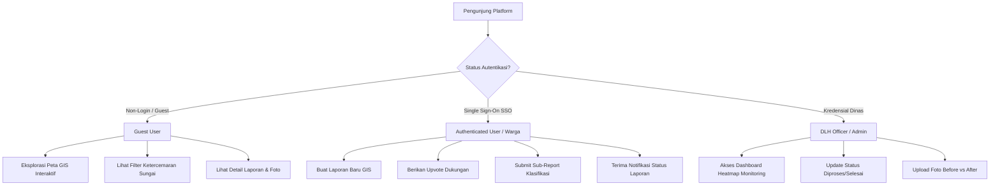
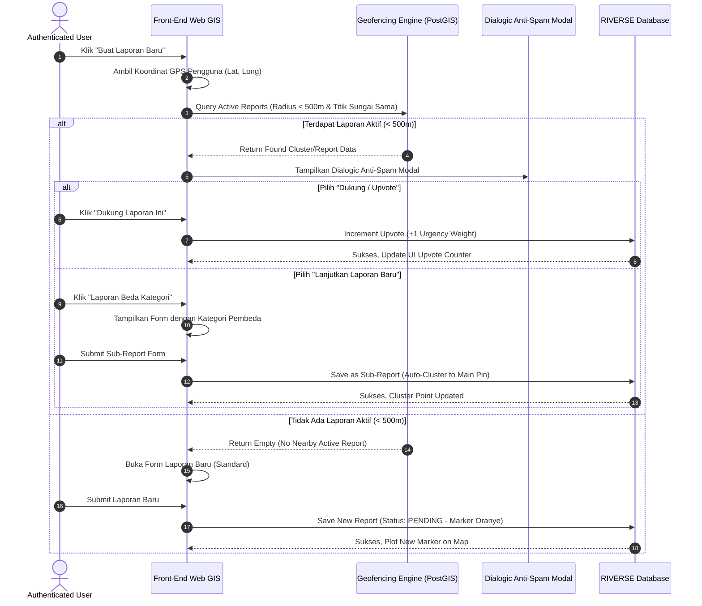
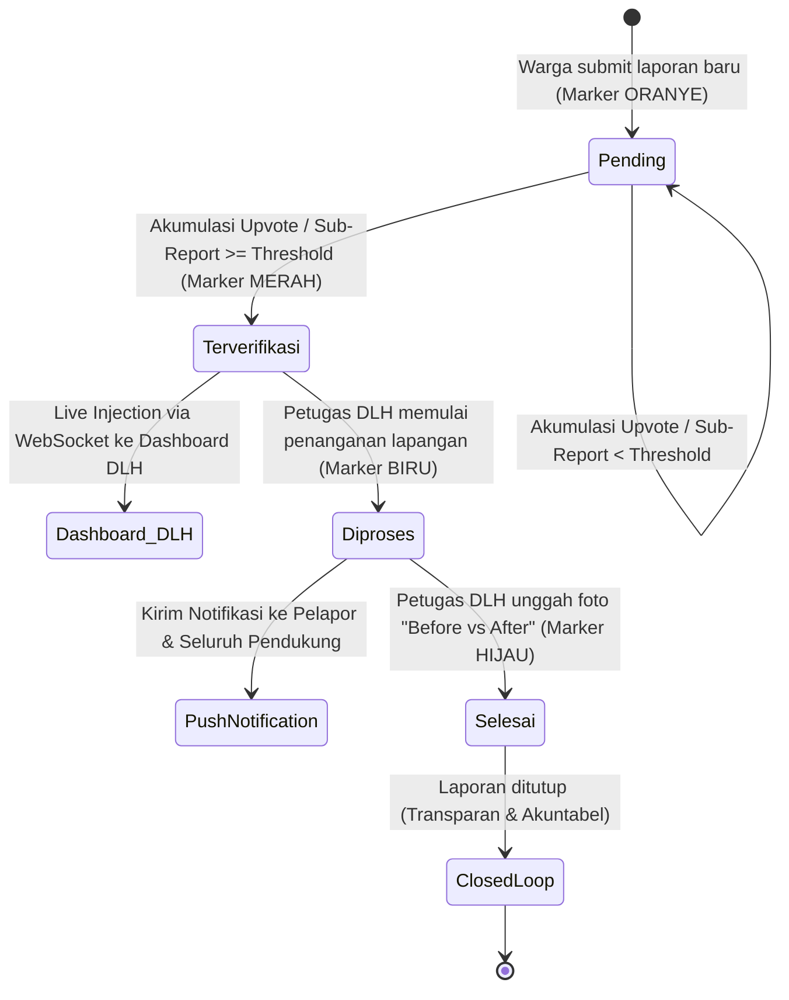
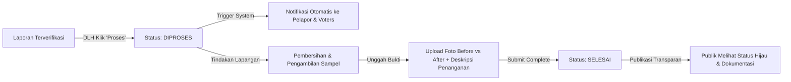
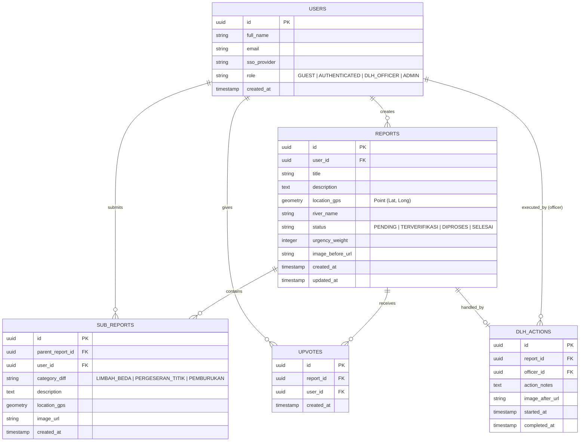

# DESIGN.md — RIVERSE
**Platform Monitoring & Pelaporan Sungai Crowdsourced**

---

## 1. Ringkasan Produk & Identitas Visual (Branding & Design System)

### 1.1 Visi & Konsep Utama
**RIVERSE** adalah sistem informasi geografis (GIS) berbasis partisipasi publik (*crowdsourcing*) yang mengintegrasikan pemantauan kondisi pencemaran sungai secara *real-time* dengan tata kelola penanganan limbah oleh **Dinas Lingkungan Hidup (DLH)**. Platform ini menjembatani aspirasi masyarakat dan tindakan responsif pemerintah melalui mekanisme verifikasi bertingkat, penanganan lokasi presisi, dan transparansi *closed-loop*.

### 1.2 Palet Warna (Color Palette)
Desain visual RIVERSE mengusung nuansa *River Sage & Clean Water* yang dipadukan dengan *Color-Coded Status Markers* untuk kemudahan navigasi GIS.

```
┌─────────────────────────────────────────────────────────────────────────┐
│                           BRAND COLOR PALETTE                           │
├──────────────┬──────────────┬──────────────┬──────────────┬─────────────┤
│  Primary     │  Secondary   │  Mint Accent │ Surface Light│ Pure White  │
│  #618264     │  #79AC78     │  #B0D9B1     │  #D0E7D2     │ #FFFFFF     │
│ (Deep Sage)  │ (River Mint) │(Soft Meadow) │ (Ice Tint)   │ (Card Bg)   │
└──────────────┴──────────────┴──────────────┴──────────────┴─────────────┘
```

#### Color Tokens Specs:
- **Primary (Deep Sage)**: `#618264` — Header, Navbar, Tombol Utama, Teks Judul Penting.
- **Secondary (River Mint)**: `#79AC78` — Accent Interactive, Active States, Hover States, Secondary Buttons.
- **Mint Accent (Soft Meadow)**: `#B0D9B1` — Chip Tag, Badge Verifikasi, Soft Highlight Container.
- **Surface Light (Ice Tint)**: `#D0E7D2` — Card Background, Input Fields, Modal Neutral Backdrop.
- **Pure White**: `#FFFFFF` — Main Canvas Background, Floating Modal Content.

#### GIS Marker Status Palette:
- 🟠 **Pending (Oranye)**: `#F97316` — Laporan baru diunggah, menunggu verifikasi komunitas.
- 🔴 **Terverifikasi (Merah)**: `#EF4444` — Threshold dukungan tercapai, masuk prioritas penanganan DLH.
- 🔵 **Diproses (Biru)**: `#3B82F6` — Petugas DLH sedang melakukan pembersihan/penanganan di lapangan.
- 🟢 **Selesai (Hijau)**: `#22C55E` — Penanganan selesai, dokumentasi *Before vs After* telah diunggah.

---

### 1.3 Tipografi (Typography Rules)
Sistem tipografi RIVERSE menggunakan font **Poppins** dengan hierarki ukuran yang presisi dan konsisten:

| Hierarki Element | Font Family | Size (px) | Weight | Line Height | Usage |
| :--- | :--- | :--- | :--- | :--- | :--- |
| **Heading 1** | Poppins | `24px` | Bold (`700`) / Semibold (`600`) | `32px` | Judul Halaman, Hero Title, Section Utama |
| **Heading 2** | Poppins | `16px` | Semibold (`600`) / Medium (`500`) | `24px` | Title Card, Header Modal, Sub-section |
| **Subheading** | Poppins | `14px` | Medium (`500`) | `20px` | Label Form, Status Badge, Tab Navigasi |
| **Paragraph** | Poppins | `12px` | Regular (`400`) | `18px` | Teks Deskripsi Laporan, Body Text, Meta Info |

---

## 2. Peran Pengguna & Aksesibilitas (User Roles & Matrix)

Aksesibilitas sistem dibagi menjadi **2 Tingkat Peranan Utama** ditambah **Role Administrator/Petugas DLH**:



### Tabel Matriks Hak Akses (Access Matrix Table):

| Fitur / Akses | Guest User (Unauthenticated) | Warga Terverifikasi (SSO User) | Petugas / Admin DLH |
| :--- | :---: | :---: | :---: |
| **Eksplor Peta Interaktif GIS** | ✅ | ✅ | ✅ |
| **Lihat Detail & Status Laporan** | ✅ | ✅ | ✅ |
| **Buat Laporan Baru** | ❌ (Redirect to SSO) | ✅ | ❌ |
| **Berikan Upvote / Dukungan** | ❌ (Redirect to SSO) | ✅ | ❌ |
| **Submit Sub-Report Differentiating** | ❌ (Redirect to SSO) | ✅ | ❌ |
| **Akses Dashboard Heatmap Prioritas** | ❌ | ❌ | ✅ |
| **Ubah Status Penanganan Laporan** | ❌ | ❌ | ✅ |
| **Upload Foto Bukti Before vs After** | ❌ | ❌ | ✅ |

---

## 3. Presisi Lokasi & Smart Anti-Spam (Geofencing & Near-Location Detection)

Untuk menjaga akurasi data lokasi sungai serta mencegah laporan palsu/ganda (*spam/fake report*), RIVERSE menerapkan mekanisme **Smart Near-Location Detection (< 500 Meter Radius)**.

### 3.1 Logika Geofencing & Spatial Detection



### 3.2 Alur Interaksi Modal Anti-Spam & Auto-Clustering

1. **Near-Location Threshold Check**:
   Menggunakan kueri geosparsial Haversine / PostGIS `ST_DWithin(location, user_gps, 500)` pada laporan yang berstatus `Pending`, `Terverifikasi`, atau `Diproses`.

2. **Opsi Dialogic Modal**:
   - **Opsi A: "Dukung Laporan Ini (Upvote)"**
     Meningkatkan bobot urgensi penanganan laporan eksisting tanpa menambah penanda *pin* baru di peta.
   - **Opsi B: "Buat Laporan Baru dengan Kategori Pembeda"**
     Memungkinkan pengguna menambahkan variasi laporan jika terdapat perbedaan signifikan:
     - Perbedaan jenis limbah (misal: Limbah Pabrik vs Sampah Domestik).
     - Pergeseran titik spesifik (lokasi tepat di hilir/hulu sungai).
     - Pemburukan kondisi (misal: Air mulai berbusa/berbau menyengat).

3. **Auto-Clustering Marker**:
   Sub-report yang disetujui akan secara otomatis dikelompokkan ke dalam 1 **Cluster Point Utama** pada peta interaktif. Hal ini mencegah *pin redundancy* dan menjaga tampilan UI/UX tetap bersih, cepat, dan informatif.

---

## 4. Logika Verifikasi Komunitas & Threshold Status (State Machine)

Sistem pengolahan laporan beroperasi sesuai *State Machine* berbasis **Threshold Dukungan Komunitas**:



### 4.1 Persamaan & Formula Threshold Status

$$\text{Total Urgency Weight } (W) = U + (\alpha \times S)$$

Di mana:
- $U$ = Jumlah Upvote Dukungan Warga
- $S$ = Jumlah Sub-Report Kategori Pembeda
- $\alpha$ = Bobot Pengali Sub-Report (Default: $\alpha = 2.0$)
- **Threshold Limit ($T$)** = Standard threshold default **10 Poin Urgensi** (dapat disesuaikan berbasis *Geographic Population Density Factor*).

Jika $W \ge T$, maka status laporan berubah otomatis dari `Pending` ➔ `Terverifikasi`.

---

## 5. Workflow Penanganan Dinas & Transparansi Publik (DLH Admin Flow)

### 5.1 Dashboard Monitoring & Heatmap Prioritas
Petugas Dinas Lingkungan Hidup (DLH) dibekali layar monitoring khusus berfasilitas **Heatmap GIS Dynamic**:
- **Heatmap Layer**: Memvisualisasikan titik sungai dengan tingkat urgensi tertinggi berdasarkan *Density Cluster* & *Total Urgency Weight*.
- **Priority Queue List**: Menyusun daftar laporan `Terverifikasi` yang diurutkan berdasarkan skor urgensi dan waktu tunggu.

### 5.2 Alur Kerja Lapangan & Pertanggungjawaban (Closed-Loop Workflow)



1. **Tahap 1: Tanggap Darurat / Penugasan Lapangan**
   Petugas mengubah status laporan dari `Terverifikasi` menjadi `Diproses` (Marker Biru). Sistem memicu *Push Notification* / Email Notifikasi otomatis kepada pelapor awal dan seluruh warga yang meng-upvote klaster tersebut.

2. **Tahap 2: Eksekusi & Dokumentasi Bukti (Before vs After)**
   Setelah penanganan limbah/pencemaran di sungai selesai, petugas wajib mengunggah:
   - **Foto Before**: Foto kondisi awal sebelum dibersihkan (diambil dari data laporan warga).
   - **Foto After**: Foto kondisi sungai setelah dibersihkan oleh tim DLH.
   - **Catatan Penanganan**: Deskripsi singkat tindakan yang diambil (misal: pengangkatan 2 ton sampah plastik, penetralan limbah cair).

3. **Tahap 3: Resolusi & Transparansi Publik (Closed Loop)**
   Status diperbarui menjadi `Selesai` (Marker Hijau). Dokumentasi foto *Before vs After* dapat diakses oleh publik pada detail pin laporan di peta interaktif, menciptakan akuntabilitas penuh.

---

## 6. Arsitektur Data & Skema Database (Database Schema ERD)

### 6.1 Entity Relationship Diagram (ERD)



---

## 7. Cetak Biru UI/UX & Desain Antarmuka (UI/UX Blueprint)

### 7.1 Layout Utama & Komponen Interaktif

1. **Header & Navigation Bar**:
   - **Logo RIVERSE** (Warna Primary `#618264` & River Mint `#79AC78`).
   - **Search & Filter Bar**: Filter status marker (Pending, Terverifikasi, Diproses, Selesai), filter nama sungai, filter rentang tanggal.
   - **SSO Login Button / User Profile Card**.

2. **Public Interactive GIS Map (Full View Canvas)**:
   - Base Map dengan layer visualisasi sungai dan titik lokasi pencemaran.
   - Dynamic Custom Pin Markers:
     - 🟠 Marker Oranye (Pending)
     - 🔴 Marker Merah (Terverifikasi)
     - 🔵 Marker Biru (Diproses)
     - 🟢 Marker Hijau (Selesai)
   - Cluster Marker dengan indikator angka jumlah sub-report.

3. **Smart Anti-Spam Modal Dialog (Responsive Component)**:
   - Header: *Pemberitahuan Lokasi Laporan Terdekat (< 500m)*
   - Visual comparison singkat laporan eksisting di titik tersebut.
   - Dual Action Card:
     - **Card A (Rekomendasi)**: "Dukung Laporan Eksisting" (Button Color: `#79AC78` River Mint).
     - **Card B**: "Buat Sub-Report Baru" (Button Variant: Outlined `#618264` Deep Sage).

4. **DLH Officer Dashboard Interface**:
   - **Heatmap View Switcher**: Peta panas tingkat urgensi limbah sungai.
   - **Tab Panel Monitoring**:
     - *Queue Terverifikasi* (Prioritas Merah)
     - *Dalam Penanganan* (Status Biru)
     - *Arsip Selesai* (Status Hijau)
   - **Modal Resolution Console**: Component unggah foto *Before vs After* dan tombol *Close Loop*.

---

## 8. Ringkasan Fitur Utama & Value Proposition

| Fitur Utama | Fungsi & Manfaat | Dampak Terhadap Publik & Pemerintah |
| :--- | :--- | :--- |
| **Crowdsourced GIS Mapping** | Pemetaan ketercemaran sungai berbasis partisipasi masyarakat secara *real-time*. | Meningkatkan kesadaran lingkungan & transparansi kondisi sungai. |
| **Smart Anti-Spam Geofencing** | Otomatisasi deteksi radius <500m dan klasterisasi laporan ganda. | Menjaga kebersihan data GIS & mencegah kebingungan penanganan. |
| **Community Threshold Escalation** | Verifikasi otomatis berbasis bobot upvote warga sekitar. | Memastikan laporan yang masuk ke pemerintah adalah laporan yang valid & urgent. |
| **DLH Heatmap Dashboard** | Visualisasi tingkat pencemaran sungai untuk penentuan skala prioritas tim dinas. | Mengoptimalkan alokasi sumber daya dan kecepatan respon penanganan. |
| **Closed-Loop Before vs After** | Kewajiban pimpinan/petugas mengunggah foto bukti hasil pembersihan. | Menjamin akuntabilitas publik dan membangun kepercayaan warga terhadap pemerintah. |

---
*Dokumen Spesifikasi Desain Produk ini disusun sebagai acuan standar pengembangan aplikasi **RIVERSE**.*
