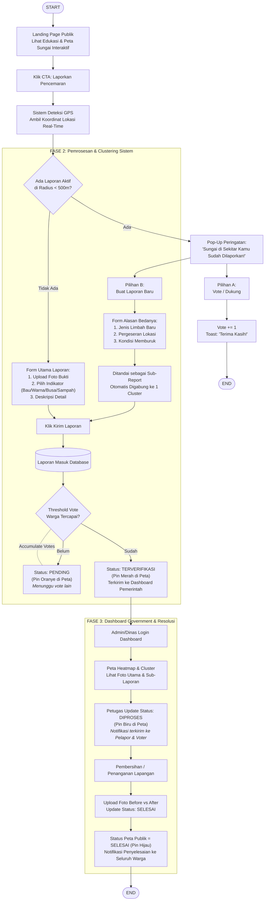

# FLOW.md — RIVERSE
**End-to-End User Flow & Skenario Penggunaan Produk**
*Dokumen resmi alur kerja sistem untuk Proposal & Scripting Presentasi Lomba CITECH 2026*

---

## 1. Ringkasan Alur Sistem (Executive Summary Flow)

RIVERSE menghubungkan masyarakat umum, warga pelapor terverifikasi, dan Dinas Lingkungan Hidup (DLH) dalam satu rantai alur kerja *closed-loop* yang seamless:

```
[ Aksen Publik / Guest ] ➔ [ Single Sign-On (SSO) ] ➔ [ GPS & Smart Geofencing (<500m) ]
           │                                                       │
           ├──────────── Ada Laporan Aktif? ───────────────────────┤
           │                      │                                │
        (Ya)                    (Ya)                              (Tidak)
   [ Modal Anti-Spam ]    [ Modal Anti-Spam ]               [ Form Utama Laporan ]
      ├── Vote (+1)          └── Buat Sub-Report                   │
      └── (Alur Selesai)            └── (Auto-Clustering)            │
                                           │                       │
                                           └─── Status: PENDING ───┘
                                                (Pin Oranye)
                                                     │
                                           [ Threshold Vote Warga ]
                                                     │
                                           Status: TERVERIFIKASI
                                                (Pin Merah)
                                                     │
                                        [ Live Injection to DLH ]
                                                     │
                                              Status: DIPROSES
                                                (Pin Biru)
                                                     │
                                        [ Pembersihan Lapangan ]
                                                     │
                                        [ Upload Before vs After ]
                                                     │
                                              Status: SELESAI
                                                (Pin Hijau)
```

---

## 2. Diagram Alur Utama (Master Flowchart Diagram)

Diagram berikut memetakan keputusan sistem dan alur pengguna secara mendetail, memvisualisasikan interaksi dari saat pertama kali warga mengakses platform hingga resolusi penanganan oleh pemerintah:



---

## 3. Narasi Detail Skenario Penggunaan (Use Case Narrative)

Berikut adalah narasi lengkap skenario penggunaan produk *end-to-end* yang disiapkan sebagai bahan penyusunan proposal dan *scripting presentation* lomba CITECH 2026.

---

### 🔵 FASE 1: Akses Publik & Eksplorasi Peta Interaktif (Guest Access)

#### 1. Pengunjung Membuka Platform
- Warga atau masyarakat umum mengakses website **RIVERSE** melalui *browser* di perangkat *mobile* maupun *desktop*.
- Pengunjung disambut oleh **Landing Page** yang bersih dan informatif, menampilkan edukasi pentingnya menjaga kelestarian sungai, indikator statistik dampak pembersihan sungai secara *real-time*, serta Peta Interaktif GIS.
- Seluruh fitur visualisasi ini dapat diakses secara gratis **tanpa harus melakukan login/autentikasi** terlebih dahulu.

#### 2. Eksplorasi Kondisi Sungai
- Pengunjung bebas menjelajahi Peta Interaktif untuk memantau kondisi kesehatan sungai di berbagai titik kota.
- Tersedia fitur filter cepat berdasarkan indikator pencemaran (misal: *Bau Menyengat*, *Air Berbusa/Berwarna*, *Penumpukan Sampah Platsik*).
- Ketika pengunjung mengklik *pin marker* pada peta, sistem menampilkan *popup detail* berisi deskripsi laporan, foto bukti, waktu kejadian, serta riwayat pembersihan sungai (*Before vs After*) jika statusnya telah selesai.

---

### 🟡 FASE 2: Autentikasi & Deteksi Lokasi Otomatis (Trigger Reporting)

#### 1. Pemicu Aksi Pelaporan / Upvote
- Ketika warga berada di tepi sungai dan menyaksikan pencemaran, warga menekan tombol **"🚨 Laporkan Pencemaran"** atau tombol **"👍 Dukung (+1 Vote)"** pada laporan sekitar.
- Jika pengguna belum masuk ke sistem, platform secara tanggap mengenali status *unauthenticated* tersebut.

#### 2. Login Akses Cepat (Single Sign-On / SSO)
- Sistem memunculkan **Pop-Up Modal Login**.
- Warga melakukan autentikasi *Single Sign-On* (SSO) menggunakan akun Google hanya dalam 1-klik. Langkah ini penting untuk memverifikasi identitas pelapor secara valid dan mencegah bahaya *bot/spam*.

#### 3. Geofencing & GPS Scanning
- Setelah berhasil login, sistem secara otomatis meminta izin akses lokasi (*browser geolocation API*).
- Sistem mengambil koordinat GPS *real-time* (Latitude, Longitude) dari perangkat warga dengan presisi tinggi.

---

### 🟠 FASE 3: Deteksi Laporan Sekitar (< 500 Meter) & Pencegahan Duplikasi

#### 1. Pemrosesan Titik Lokasi (Near-Location Detection Engine)
- Sistem mengolah koordinat GPS warga dan membandingkannya dengan basis data laporan aktif di titik sungai yang sama dalam radius **kurang dari 500 meter**.

#### 2. Kondisi A: Ada Laporan Aktif di Radius < 500 Meter
Sistem menampilkan **Dialogic Anti-Spam Modal** dengan pesan:
> *"Sungai di sekitar kamu sudah dilaporkan 2 jam lalu oleh warga lain!"*

Warga disajikan 2 pilihan interaksi:
- **Opsi 1 (Upvote / Dukung)**: Warga menekan tombol **"Dukung (+1 Vote)"**. Bobot dukungan pada laporan lama otomatis bertambah 1, sistem menampilkan *toast notification* *"Terima kasih atas dukunganmu!"*, dan alur selesai tanpa perlu mengisi form ulang.
- **Opsi 2 (Tetap Buat Laporan Baru)**: Jika warga merasa kondisi sungai memiliki perbedaan signifikan, warga memilih **"Tetap Buat Laporan Baru"** dan memilih alasan pembeda (seperti: *Jenis Limbah Baru*, *Pergeseran Lokasi Spesifik*, atau *Kondisi Memburuk*).

#### 3. Kondisi B: Tidak Ada Laporan Aktif di Radius < 500 Meter
- Warga langsung diarahkan ke **Form Utama Pelaporan** tanpa hambatan modal anti-spam.

---

### 🟢 FASE 4: Pengisian Form & Auto-Clustering Sistem

#### 1. Pengisian Data Laporan
- Warga mengunggah foto bukti kondisi sungai langsung dari kamera smartphone/galeri.
- Warga memilih indikator pencemaran (*Bau Menyengat*, *Air Keruh/Berbusa*, *Penumpukan Sampah*).
- Warga menambahkan deskripsi singkat mengenai kondisi di lapangan, kemudian menekan tombol **"Kirim Laporan"**.

#### 2. Pemrosesan Auto-Clustering (Backend Engine)
- **Sub-Report Case**: Jika laporan berasal dari *Opsi Laporan Baru* di lokasi berdekatan (< 500m), backend menandainya sebagai **Sub-Report** dan menggabungkannya ke dalam 1 **Cluster Point** di peta publik. Tampilan peta tetap rapi tanpa terjadi penumpukan *pin* (*overlapping pins*).
- **New Cluster Case**: Jika laporan berasal dari lokasi baru, sistem membuat titik *Cluster Point* baru di peta GIS.

#### 3. Transasi Status Pending (Pin Oranye)
- Laporan yang baru dikirim masuk ke database dengan status **Pending** (ditandai dengan *pin marker* berwarna Oranye).
- Laporan berstatus *Pending* memerlukan akumulasi konfirmasi/upvote dari warga sekitar sebelum dapat diteruskan ke pihak berwenang.

---

### 🔴 FASE 5: Ambang Batas Dukungan & Eskalasi ke Pemerintah

#### 1. Pencapaian Threshold Validasi
- Warga lain yang melintas atau bermukim di sekitar sungai dapat melihat *pin* Oranye pada peta publik dan memberikan *upvote* atau konfirmasi tambahan.

#### 2. Verifikasi Komunitas (Escalation to Red Pin)
- Begitu akumulasi *Urgency Weight* (Upvote + Sub-Reports) mencapai batas ambang (**Threshold Limit**), status laporan secara otomatis berubah menjadi **Terverifikasi** (ditandai dengan *pin marker* berwarna Merah pada peta publik).
- Data laporan secara *real-time* terinjeksi (*live websocket event*) ke dalam **Dashboard Monitoring Dinas Lingkungan Hidup** sebagai daftar prioritas penanganan.

---

### 🔵 FASE 6: Tindak Lanjut Dinas & Resolusi Transparan (Closed Loop)

#### 1. Monitoring & Penugasan Petugas (DLH View)
- Petugas Dinas Lingkungan Hidup memantau *Heatmap* pada dashboard monitoring dan melihat titik *pin* Merah berprioritas tinggi berdasarkan skor urgensi terbanyak.
- Petugas mengubah status laporan menjadi **Diproses** (ditandai dengan *pin marker* berwarna Biru).
- Sistem secara otomatis mengirimkan *Push Notification* ke seluruh warga pelapor dan warga yang berpartisipasi memberikan *upvote* pada klaster tersebut.

#### 2. Aksi Pembersihan di Lapangan
- Tim lapangan DLH diterjunkan langsung ke lokasi sungai untuk melakukan aksi pembersihan sampah atau penyedotan limbah cair.

#### 3. Dokumentasi & Penutupan Laporan (Status Selesai)
- Setelah sungai bersih dan tertangani, petugas mengunggah **Foto Bukti Before vs After** beserta catatan tindakan ke dalam sistem.
- Petugas memperbarui status laporan menjadi **Selesai** (ditandai dengan *pin marker* berwarna Hijau).

#### 4. Penyelesaian Transparan (Closed Loop Accountability)
- Seluruh *pin* pada peta publik berubah menjadi **Hijau (Selesai)**.
- Seluruh warga yang terlibat menerima notifikasi penyelesaian: *"Laporan sungai di lokasimu telah sukses dibersihkan oleh DLH!"*.
- Rantai alur penanganan selesai secara akuntabel, transparan, dan terpercaya.

---

## 4. Matriks Transisi Status Laporan (Status Lifecycle Matrix)

| Status | Kode Warna Marker | Trigger Perubahan Status | Aksi Sistem (System Behavior) | Notifikasi Pengguna |
| :--- | :---: | :--- | :--- | :--- |
| **Pending** | 🟠 Oranye | Warga mengirimkan laporan baru. | Disimpan di DB, diplot pada peta publik, menunggu akumulasi vote warga. | Toast: *"Laporan berhasil dibuat. Menunggu verifikasi warga sekitar."* |
| **Terverifikasi** | 🔴 Merah | Total Urgency Weight $\ge$ Threshold. | Otomatis diinjeksi ke Dashboard Monitoring DLH & prioritas Heatmap. | Notification: *"Laporanmu telah diverifikasi warga & diteruskan ke DLH!"* |
| **Diproses** | 🔵 Biru | Petugas DLH menekan tombol *Proses Penanganan*. | Mengunci klaster, mengaktifkan mode penugasan tim lapangan DLH. | Push Notification: *"Tim DLH sedang menuju lokasi sungai untuk pembersihan."* |
| **Selesai** | 🟢 Hijau | Petugas DLH mengunggah foto *Before vs After*. | Menutupi alur (*closed loop*), mempublikasikan bukti foto ke umum. | Push Notification: *"Sungai selesai dibersihkan! Lihat foto Before vs After."* |

---

## 5. Ringkasan Fitur Unggulan untuk Scripting Presentasi Lomba

Saat melakukan presentasi atau penyusunan *pitch deck* CITECH 2026, tekankan **4 Pilar Keunggulan Alur RIVERSE**:

1. **Zero-Barrier Guest Access**: Publik bisa langsung memantau kondisi sungai tanpa dipaksa login di awal.
2. **1-Click SSO & Frictionless Reporting**: Autentikasi kilat berbasis Google SSO mencegah bot sekaligus mempermudah warga.
3. **Smart 500m Geofencing Anti-Spam**: Mengeliminasi duplikasi laporan dan menghemat beban penanganan pemerintah melalui *Auto-Clustering*.
4. **Closed-Loop Public Transparency**: Pertanggungjawaban penuh dengan bukti dokumentasi *Before vs After* yang dapat diaudit seluruh publik.

---
*Dokumen Spesifikasi Alur Sistem ini merupakan bagian tak terpisahkan dari standar aplikasi **RIVERSE**.*
