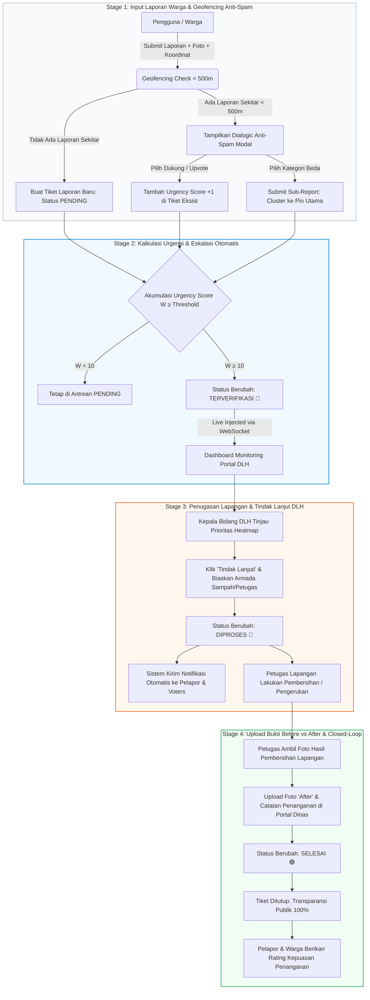

# WORKFLOW_DINAS.md — Standar Operasional Prosedur (SOP) & Alur Kerja Penanganan Dinas Lingkungan Hidup (DLH)

## 🏢 Platform RIVERSE — Governed Closed-Loop System

Dokumen ini menjelaskan alur kerja (*workflow*), tata kelola operasional, serta integrasi sistem pengawasan spasial GIS antara **Laporan Masyarakat** dan **Tindakan Lapangan Dinas Lingkungan Hidup (DLH)**.

---

## 1. Diagram Alur Kerja Utuh (End-to-End Governance Workflow)

---

## 2. Matriks Status & Indikator Warna GIS

| Status Laporan | Warna GIS | Kode Warna | Penanggung Jawab | Deskripsi Operasional |
| :--- | :---: | :---: | :--- | :--- |
| **Pending** | 🟠 Oranye | `#F97316` | Warga & Komunitas | Laporan baru diunggah oleh warga, sedang mengumpulkan dukungan *upvote*. |
| **Terverifikasi** | 🔴 Merah | `#EF4444` | Sistem & Kabid DLH | *Urgency Score* mencapai threshold (W ≥ 10), masuk dalam antrean prioritas dinas. |
| **Diproses** | 🔵 Biru | `#3B82F6` | Tim Lapangan DLH | Petugas dan armada sampah telah didispensasikan dan sedang melakukan pembersihan. |
| **Selesai** | 🟢 Hijau | `#22C55E` | Administrator DLH | Pembersihan selesai, bukti foto *Before vs After* diunggah, tiket ditutup transparan. |

---

## 3. Formula Matriks Urgensi Penanganan (Urgency Score Algorithm)

Untuk menentukan urutan prioritas pada Dashboard DLH, sistem menggunakan formula perhitungan *Urgency Score* ($W$):

$$\text{Total Urgency Weight } (W) = U + (\alpha \times S) + \beta$$

**Keterangan Variabel:**
- $U$ = Jumlah dukungan *upvote* dari warga terverifikasi (SSO).
- $S$ = Jumlah *sub-report* kategori pembeda pada radius cluster < 500m.
- $\alpha$ = Bobot pengali *sub-report* (Default: $\alpha = 2.0$).
- $\beta$ = Bobot bobot indikator khusus (misal: Laporan Limbah Bahan Berbahaya/B3 = +5.0).
- **Threshold Limit ($T$)**: Default **10 Poin Urgensi** untuk naik status ke `Terverifikasi 🔴`.

---

## 4. Tahapan SOP Petugas Lapangan Dinas (DLH Field Officer SOP)

### Tahap 1: Pemantauan Dashboard Spasial (Pukul 08.00 & 13.00 WIB)
1. Petugas admin/Kabid DLH membuka portal **`/dinas`**.
2. Memeriksa tab antrean **Prioritas Tinggi (Terverifikasi 🔴)**.
3. Memeriksa sebaran titik pada **Peta Heatmap Spasial GIS**.

### Tahap 2: Penugasan Tim & Penentuan Armada
1. Petugas mengklik tombol **"Tindak Lanjuti Laporan"** pada tiket laporan target.
2. Memilih nama tim penanggung jawab (misal: *Tim Pasukan Oranye Segmen Ciliwung*) dan jenis armada (misal: *Truk Sampah 6 Roda / Kapal Pengeruk*).
3. Mengubah status laporan menjadi **Diproses 🔵**.

### Tahap 3: Eksekusi Pembersihan & Pengambilan Foto Bukti
1. Tim lapangan tiba di lokasi spasial sesuai koordinat GPS presisi.
2. Mengambil foto kondisi awal (**Before**) sebelum pembersihan.
3. Melakukan pembersihan sampah / penyedotan limbah / pengerukan bantaran.
4. Mengambil foto kondisi akhir setelah bersih (**After**).

### Tahap 4: Penutupan Tiket & Upload Dokumentasi (Closed-Loop Transparency)
1. Petugas membuka modal **"Penyelesaian Laporan"** di Dashboard Dinas.
2. Mengunggah foto bukti **After** hasil pembersihan.
3. Mengisi catatan ringkas penanganan (misal: *"Telah diangkut 2.5 ton sampah plastik dari bantaran sungai"*).
4. Klik **"Tutup Tiket & Publikasikan (Selesai 🟢)"**.
5. Notifikasi penutupan otomatis terintegrasi ke pengguna pelapor dan publik.

---

## 5. Keamanan & Akuntabilitas Data

- **Log Audit Terkunci**: Setiap perubahan status (`Terverifikasi` ➔ `Diproses` ➔ `Selesai`) dicatat beserta nama petugas, NIP, dan stempel waktu (*timestamp*).
- **Watermark GPS Foto**: Foto bukti *Before vs After* otomatis diverifikasi metadata EXIF lokasi spasialnya untuk menjamin keaslian penanganan di lapangan.
